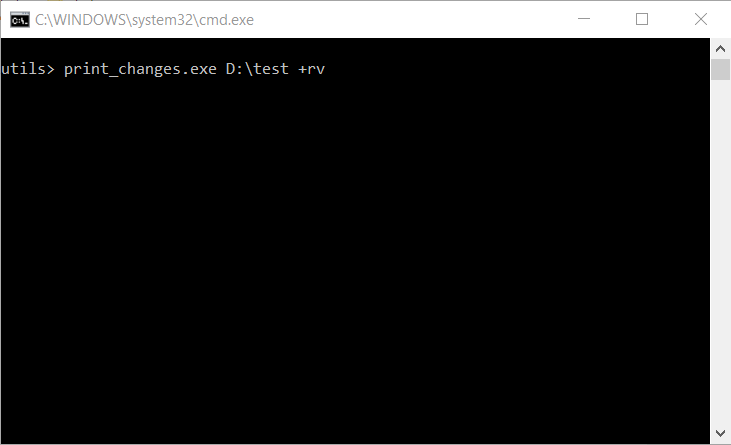

# Samples for Windows I/O Completion Ports

[](https://ci.appveyor.com/project/grishavanika/win-io)

# Use-cases

- Directory changes ([::ReadDirectoryChangesW()] wrapper)

[::ReadDirectoryChangesW()]: https://msdn.microsoft.com/en-us/library/windows/desktop/aa365465(v=vs.85).aspx

# Tested/supported compilers

C++17 library `string_view`, `optional`, `std::variant` is in use.

Tested with GCC 7.3.0, MSVC 2017, Clang 7.0.0

# Examples

#### print_changes (src/utils)



```
print_changes.exe
Help:
print_changes.exe <directory> +flags
Note: + without any flags (or empty filters flags) means all filters flags
General flags:
        r: Recursive directory watch (watch with subtree)
        v: Verbose output to stderr (errors + options)
        h: Print help and exit
Input filters flags:
        f: File name change (renaming, creating, or deleting a file)
        d: Directory name change (creating or deleting a directory)
        a: Attribute change
        s: File size change
        w: Last write time change of files
        t: Last access time change of files
        c: Creation time change of files
        s: Security descriptor change
Output actions flags:
        a: File was added to the directory
        r: File was removed from the directory
        m: File was modified (time stamp or attributes)
        o: File was renamed and this is the old name
        n: File was renamed and this is the new name
Example:
print_changes.exe C:\ +rf

Possible output:
+a new_file.txt
+o file_with_old_name.txt
+r file_was_removed.txt
+n file_with_new_name.txt
```

